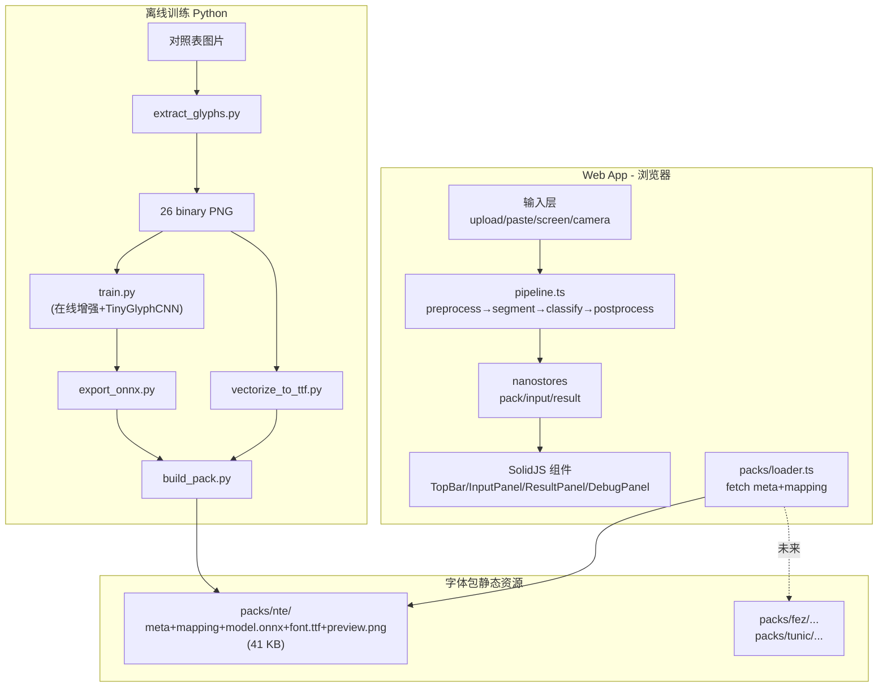

# Sigil 交接文档（下一次对话入口）

> **下一次对话开始时请先读这份文档。** 它包含恢复上下文所需的全部关键信息：项目目标、已完成的阶段、关键决策、当前状态、已知坑点、下一步计划。

---

## 1. TL;DR — 一句话说清现状

**目标**：浏览器内运行的多游戏自创文字识别翻译工具，首发支持 NTE（异环 / Neverness to Everness）。

**目前进度**：Phase 0、0a、1、2 **全部完成**。从一张玩家社区对照表出发，已端到端跑通"提取 → 训练 → ONNX 导出 → 41KB 字体包 → Astro+SolidJS Web 应用骨架（占位 CV/推理）"。**剩下的是 Phase 3-4：把 `apps/web/src/lib/pipeline.ts` 里的占位实现换成真实的 OpenCV.js + ONNX Runtime Web。**

**关键路径**：用户提供的"字体文件"是误识别（详见 §6），但发现了完整对照表图片 → 自动提取 26 glyph → 用强增强训练小 CNN → 验证集准确率 99.23%。

---

## 2. 项目身份与用户偏好（务必先读）

- **用户语言**：中文。所有 UI 文案、注释、文档用中文。代码命名仍然英文。
- **emoji 政策**：除非用户明示要求，**不要在任何输出里用 emoji**（包括代码、文档、回复）。
- **决策风格**：用户喜欢"先理性讨论选项，再让我拍板"。遇到架构选择不要直接闷头干，用 `AskQuestion` 工具问 1-2 个关键问题。
- **务实优先**：用户多次表达"先快后慢"——能用现成方案先用，验证了再投入精力建集成。例如对照表 → 自动提取 vs 手工描摹，明显选前者；Glyphr Studio vs 自建描摹器，先用 Glyphr。
- **要提质疑**：用户在 LastResort.ttf 那次担心"字体路线走不通"，事实证明是对的。**当用户表达对方案的怀疑时，认真对待**。
- **项目规则（来自 user_rules）**：参考 Vallhalla（Astro + SolidJS + Tailwind + Nano Stores + Shadow DOM）和 Project Dock（Rust+Ratatui）的偏好，本项目沿用 Vallhalla 同款前端栈但不需要 Shadow DOM。

---

## 3. 整体架构



**两个核心抽象**：
1. **GlyphPack**：每个游戏一个目录，含 `meta.json` + `mapping.json` + `model.onnx` + `font.ttf` + `preview.png`。**新增游戏不动核心代码**。
2. **pipeline.ts**：识别流水线的唯一切换点。Phase 2 是 stub；Phase 3-4 替换内部实现。

---

## 4. 阶段进度

| 阶段 | 状态 | 产物 | 关键报告 |
|---|---|---|---|
| Phase 0：字体可用性验证 | 完成 | 否决 LastResort.ttf（Apple fallback 字体） | [`nte-font-report.md`](nte-font-report.md) |
| Phase 0a：手工描摹（原计划）| 跳过 | 改为从对照表自动提取（更好） | — |
| Phase 0a'：对照表提取 | 完成 | 26 个二值化 PNG + mapping.json | — |
| Phase 1：训练流水线 | 完成 | 41KB 字体包，val acc 99.23%，sanity 26/26 | [`phase1-training-report.md`](phase1-training-report.md) |
| Phase 2：Web App 骨架 | 完成 | Astro+SolidJS+Tailwind+nanostores 全链路 | 本文档 §7 |
| **Phase 3：OpenCV.js CV 流水线** | **待做** | 字符分割实现 | — |
| **Phase 4：ONNX Runtime Web 推理** | **待做** | 真实 CNN 推理 | — |
| Phase 5：真实截图评测 | 待做 | 端到端准确率报告 | — |
| Phase 6：扩展游戏 | 待做 | Fez/原神/Tunic 字体包 | — |
| Phase 7：集成描摹器（可选）| 待做 | Paper.js + opentype.js | — |

---

## 5. 文件结构（重点位置）

```
/Users/lavac/mine/2026/glyphlens/
├── README.md                              入口文档
├── package.json + pnpm-workspace.yaml     pnpm workspace 根
├── .venv/                                 Python 训练环境（已装 torch/cv2/onnx/albumentations 等）
├── docs/
│   ├── HANDOFF.md                         ★ 本文件
│   ├── nte-font-report.md                 Phase 0 报告
│   ├── glyphr-tracing-guide.md            备用（描摹工具指南）
│   └── phase1-training-report.md          Phase 1 报告
├── packs/nte/                             ★ 生产字体包（前端会 fetch）
│   ├── meta.json
│   ├── mapping.json
│   ├── model.onnx                         20.5 KB
│   ├── font.ttf                           6 KB
│   └── preview.png
├── training/
│   ├── scripts/                           全套训练脚本
│   │   ├── inspect_font.py                字体元信息分析
│   │   ├── extract_glyphs.py              对照表 → 26 glyph
│   │   ├── dataset.py                     GlyphDataset + 增强
│   │   ├── model.py                       TinyGlyphCNN (96k params)
│   │   ├── train.py                       训练循环 + 混淆矩阵
│   │   ├── export_onnx.py                 ONNX 导出 + sanity check
│   │   ├── vectorize_to_ttf.py            cv2 → 多边形 → fontTools TTF
│   │   ├── preview_augmentation.py        增强可视化
│   │   ├── preview_ttf.py                 TTF 渲染验证
│   │   └── build_pack.py                  打包到 packs/<id>/
│   ├── checkpoints/nte/                   best.pt, model.onnx, confusion.png, sanity_report.json
│   └── source/nte/
│       ├── reference_chart.png            ★ 用户提供的对照表原图
│       ├── LastResort.ttf                 ★ 苹果 fallback 字体，与 NTE 无关
│       ├── mapping.json                   提取后的字母映射
│       ├── glyphs/
│       │   ├── raw/<A-Z>.png              切分原图
│       │   ├── binary/<A-Z>.png           二值化训练源
│       │   ├── preview.png                26 字母总览
│       │   └── augmentation_preview.png   增强样本可视化
│       └── traced/nte.ttf                 矢量化生成的字体
└── apps/web/                              ★ Web App
    ├── astro.config.mjs                   ★ 注意 COOP/COEP headers
    ├── tsconfig.json                      path alias: ~/* -> src/*
    ├── package.json
    ├── public/
    │   ├── favicon.svg
    │   └── packs -> ../../../packs        ★ 软链：前端零拷贝复用 packs/
    └── src/
        ├── pages/index.astro              入口
        ├── layouts/Base.astro             HTML 外壳
        ├── components/
        │   ├── App.tsx                    根组件
        │   ├── TopBar.tsx                 顶栏 + pack 状态
        │   ├── GameSelector.tsx           字体包下拉
        │   ├── InputPanel.tsx             4 种输入源 + 触发识别
        │   ├── ResultPanel.tsx            识别结果 + 置信度配色
        │   └── DebugPanel.tsx             NTE 字体渲染 + meta JSON
        ├── lib/
        │   ├── packs/loader.ts            fetch /packs/<id>/{meta,mapping}.json
        │   └── pipeline.ts                ★★★ Phase 3-4 要替换的关键文件
        ├── stores/
        │   ├── pack.ts                    当前 pack + bootstrap
        │   ├── input.ts                   当前输入图像
        │   └── result.ts                  识别结果 + 触发器
        ├── types/pack.ts                  ★ GlyphPack/RecognitionResult 等强类型
        └── styles/global.css              Tailwind v4 + Catppuccin Mocha
```

---

## 6. 已知坑点与重要决策

### 6.1 LastResort.ttf 不是 NTE 字体
用户最初放进 `training/source/nte/LastResort.ttf` 的"可能的 NTE 字体文件"经分析确认为 **Apple 的 Unicode fallback 字体**（Manufacturer=Apple Inc.，覆盖 388k 码位）。文件保留在原处作为决策记录，**不要拿它去训练**。

### 6.2 对照表是数据宝藏
用户后来提供的 `training/source/nte/reference_chart.png` 是一张 7×8 网格的玩家社区破译表（行 0/2/4/6 是英文，行 1/3/5/7 是 NTE glyph）。Phase 1 全部数据从这张图来。

**潜在风险**：对照表的形状可能和游戏内实际渲染存在系统性偏差。Phase 5 必须用真实游戏截图评测来验证。

### 6.3 albumentations 2.x API
- `A.Affine` 用 `fill=255` 而非旧的 `cval=255`
- `A.Perspective` 用 `fill=255` 而非旧的 `pad_val=255`
- 已在 `dataset.py` 修复

### 6.4 ONNX 导出
- Torch 2.12 的 `torch.onnx.export` 用新 dynamo exporter，需要 `onnxscript` 依赖
- 请求 opset 17 时会自动 fallback 到 18（不影响）
- 已在 venv 装好

### 6.5 Astro 必须用 `client:only="solid-js"`
- 因 Solid 组件用了 `document.addEventListener` 等浏览器 API，**不能 SSR**
- `apps/web/src/pages/index.astro` 中已用 `client:only="solid-js"`
- 不要改回 `client:load`

### 6.6 packs 软链
- `apps/web/public/packs -> ../../../packs`（相对符号链接）
- 训练流水线产物自动可被前端 fetch，零拷贝
- 部署到 Cloudflare Pages 时需确认软链被正确发布（如不行就改成构建脚本复制）

### 6.7 nanostores peer dep warning
- `@nanostores/solid@0.5.0` 期望 `nanostores ^0.11`，但装了 `nanostores 1.3.0`
- 实测可用，已通过 dev server 验证
- 如果未来出问题，要么降 nanostores 到 ^0.11，要么找更新版的 `@nanostores/solid`

### 6.8 COOP/COEP headers
- `astro.config.mjs` 配了 `Cross-Origin-Opener-Policy: same-origin` + `Cross-Origin-Embedder-Policy: require-corp`
- 目的：让 ONNX Runtime Web 能用 SharedArrayBuffer / WebGPU
- 副作用：第三方资源（图片/字体）需要 CORP header 才能加载，目前所有资源都同源所以没问题

### 6.9 deprecated icon hints
- `lucide-solid` 把 `Wand2` 和 `Github` 标记为 deprecated（不影响运行）
- 看到 hint 不要紧张，可以等真改名时再改

---

## 7. 启动与验证

### 7.1 启动 dev server
```bash
cd /Users/lavac/mine/2026/glyphlens
pnpm dev
# 打开 http://localhost:4321/
```

### 7.2 端到端 smoke test（手动）
1. 打开页面 → 顶栏应显示 "模型 20.5KB · 训练精度 100.0%"
2. 点击 "上传" → 选 `packs/nte/preview.png`（或任意图片）→ 应显示预览
3. 点击 "开始识别" → 应显示 stub 结果（HELLO WORLD 等随机短语）
4. 滚动到底部，展开 "调试 / 字体包元信息" → 应看到 "HELLO WORLD" 用 NTE 字体渲染

### 7.3 重新训练（如改动数据）
```bash
cd /Users/lavac/mine/2026/glyphlens
PYTHONPATH=training/scripts .venv/bin/python training/scripts/extract_glyphs.py
PYTHONPATH=training/scripts .venv/bin/python training/scripts/train.py
PYTHONPATH=training/scripts .venv/bin/python training/scripts/export_onnx.py
PYTHONPATH=training/scripts .venv/bin/python training/scripts/vectorize_to_ttf.py
PYTHONPATH=training/scripts .venv/bin/python training/scripts/build_pack.py
```

### 7.4 类型检查
```bash
cd /Users/lavac/mine/2026/glyphlens/apps/web
pnpm exec astro check
```

---

## 8. Phase 3-4 实施指引（下一对话主要任务）

### 8.1 Phase 3：OpenCV.js 集成 + 字符分割

**依赖**：
```bash
cd /Users/lavac/mine/2026/glyphlens/apps/web
pnpm add @techstark/opencv-js
# 或者用 CDN 加载官方 opencv.js（约 8MB WASM）
```

`@techstark/opencv-js` 提供了 TypeScript 类型与 npm 包，比官方 CDN 友好。

**新建文件**：`apps/web/src/lib/cv/`
- `loader.ts`：懒加载 OpenCV.js（首次调用时初始化）
- `preprocess.ts`：灰度 → 自适应阈值 → 去噪
- `segment.ts`：MSER 检测文字区域 → 字符级连通域 → 输出 ROI 数组
- `debug.ts`：把中间产物画成 dataURL 给 DebugPanel

**契约**（`segment` 返回的每个 ROI）：
```ts
interface DetectedGlyph {
  bbox: [number, number, number, number];   // 原图坐标
  patch: ImageData;                          // 已裁剪+归一化到 64x64 灰度
}
```

**调试退路**：DebugPanel 里加一个"显示分割框"按钮（用 canvas 在原图上画 bbox）。

### 8.2 Phase 4：ONNX Runtime Web 推理

**依赖已装**：`onnxruntime-web@1.23.2`（在 `apps/web/package.json`）

**新建文件**：`apps/web/src/lib/inference/`
- `session.ts`：单例 `InferenceSession`，按 pack id 缓存
- `predict.ts`：批量推理 ROI patches → softmax → argmax + top-3

**关键代码片段**：
```ts
import * as ort from "onnxruntime-web";

const session = await ort.InferenceSession.create(modelUrl, {
  executionProviders: ["webgpu", "wasm"],
});

const input = new ort.Tensor("float32", normalized, [batchSize, 1, 64, 64]);
const output = await session.run({ input });
const logits = output["logits"]?.data as Float32Array;
```

**归一化协议**（来自 `mapping.json` 的 `model_input.normalization`）：
```
pixel / 255 - 0.5) / 0.5  // 等价于 (pixel - 127.5) / 127.5
```

**色彩极性**：`invariant_to_color_polarity: true` —— 输入时可以传白底黑字或黑底白字，模型都能处理（训练时有 50% 反色增强）。但推理时统一规范化为白底黑字（255 背景）效果会更稳。

### 8.3 把两者接入 `pipeline.ts`

**当前**：
```ts
export async function recognize(input, pack): Promise<RecognitionResult> {
  // stub: 假数据
}
```

**目标**：
```ts
export async function recognize(input, pack): Promise<RecognitionResult> {
  const t0 = performance.now();
  const preprocessed = await preprocess(input.bitmap);
  const t1 = performance.now();
  const rois = await segment(preprocessed);
  const t2 = performance.now();
  const predictions = await classify(rois, pack);  // 用 ONNX Runtime
  const t3 = performance.now();
  const result = postprocess(predictions, pack.mapping);
  const t4 = performance.now();
  return { text: ..., glyphs: ..., elapsedMs: t4-t0, stageTimings: {...} };
}
```

**UI 不需要任何改动**——`RecognitionResult` 类型已经在 `types/pack.ts` 定义齐全。

### 8.4 Phase 5：真实截图评测

需要用户提供 20-50 张真实 NTE 游戏截图（PV 截帧、UP 主视频截图等），放到 `training/samples/nte/`，手工标注 ground truth（写到 `samples/nte/ground_truth.json`），跑端到端评测脚本输出准确率。

**如果准确率低**（< 80%）：扩充数据增强或加少量真实截图微调模型；如果是分割问题，调 CV pipeline 参数。

---

## 9. 关键命令速查

| 任务 | 命令 |
|---|---|
| 启动 Web 应用 | `pnpm dev`（在 glyphlens 根目录） |
| 类型检查 | `cd apps/web && pnpm exec astro check` |
| 构建前端 | `pnpm build` |
| Python 训练（任意脚本）| `PYTHONPATH=training/scripts .venv/bin/python training/scripts/<X>.py` |
| 重新打包字体包 | 见 §7.3 |

---

## 10. 项目仍未解决的开放问题

1. **真实游戏渲染 vs 对照表偏差**：Phase 5 才能量化
2. **数字、标点支持**：当前 NTE 字体包只有 26 字母。游戏内若出现数字/标点需补充
3. **多行文本**：当前架构假设输入是单行/独立字符。多行文本需在 segment 阶段加行检测
4. **Tunic 复合字符**：将来接入 Tunic 时需在 `meta.json` 加 `split_rules.json` 引用，并在 segment 阶段做笔画级拆解
5. **PWA / Service Worker**：尚未配置离线缓存。Phase 6 之后再考虑
6. **部署**：尚未配过 Cloudflare Pages / Vercel。需确认软链 `public/packs` 在构建时被正确解析

---

## 11. 下一次对话建议开场

下一次对话开始时，建议这样开场：

> "用户上轮做完了 Phase 0-2，剩下 Phase 3-4。我先读 `docs/HANDOFF.md` 拿全上下文，然后启动 dev server 确认现状，再开始 Phase 3（OpenCV.js 集成）"

务必先读完本文档再动手。

---

**最后更新**：2026-05-24，本对话结束前
**当前 dev server 状态**：在后台运行（http://localhost:4321/）
