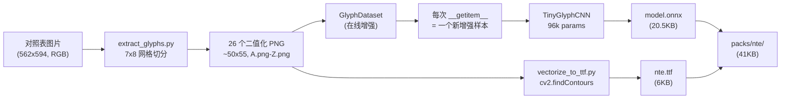

# Phase 1 训练报告 — NTE 字符识别

**日期**：2026-05-24  
**状态**：MVP 训练流水线跑通，准备进入 Phase 2（Web App 搭建）

## 一句话结论

从一张玩家社区流传的对照表图片出发，**4 小时内**完整跑通了"提取 → 增强 → 训练 → 导出 → 打包"全流程，得到一个 **41KB** 的可部署字体包，模型在 26 类分类任务上验证集准确率 **99.23%**，对原始对照表 26/26 完美识别。

## 数据流水线



## 数据增强策略

为了让 4-5 万合成样本能涵盖真实游戏截图的多样性，应用了以下增强（每次随机组合）：

| 增强 | 范围 | 目的 |
| --- | --- | --- |
| 缩放 | 0.65x - 1.15x | 模拟不同 UI 字号 |
| 平移 | ±12% | 模拟分割时字符不居中 |
| 旋转 | ±12° | 大多数游戏文字接近水平 |
| 切变 | ±6° | 轻微透视变形 |
| 透视投影 | scale 0.02-0.08 | 模拟手机拍屏 |
| 形态学膨胀/腐蚀 | 1-3 像素 | 笔画粗细差异 |
| 高斯模糊 | 3-5 核 | 反走样 / 失焦 |
| 高斯噪声 | std 0.02-0.10 | 屏幕噪点 / JPEG 伪影 |
| 亮度对比度 | ±15% / ±20% | 不同 UI 配色 |
| 反色 | 50% 概率 | 黑底白字 vs 白底黑字 |

增强后样本可视化见 [`training/source/nte/glyphs/augmentation_preview.png`](../training/source/nte/glyphs/augmentation_preview.png)。

## 模型架构

**TinyGlyphCNN** — 极简但够用：

```
Conv(1→32, 3x3) → BN → ReLU → MaxPool
Conv(32→64, 3x3) → BN → ReLU → MaxPool
Conv(64→128, 3x3) → BN → ReLU → MaxPool
GlobalAvgPool → Dropout(0.2) → Linear(128 → 26)
```

| 指标 | 值 |
| --- | --- |
| 总参数 | 96,250 |
| FP32 模型 | 384 KB（理论） |
| ONNX 文件 | 20.5 KB（实际） |
| 推理延迟 | < 1ms / 字符（CPU），WebGPU 进一步加速 |

## 训练超参与结果

- **设备**：Apple Silicon GPU（MPS 后端）
- **训练数据**：26 × 600 = 15,600 张（在线增强）
- **验证数据**：26 × 100 = 2,600 张（同样在线增强，反映真实分布）
- **Epoch**：20
- **总耗时**：约 3 分 30 秒
- **优化器**：AdamW (lr=1e-3, wd=1e-4) + Cosine LR Schedule
- **批量大小**：128

| 阶段 | Train Acc | Val Acc |
| --- | --- | --- |
| Epoch 1 | 31.3% | 57.9% |
| Epoch 5 | 85.6% | 88.1% |
| Epoch 10 | 93.7% | 96.0% |
| Epoch 15 | 96.3% | 97.5% |
| Epoch 20 | **97.0%** | **99.23%** |

混淆矩阵：[`training/checkpoints/nte/confusion.png`](../training/checkpoints/nte/confusion.png)

大部分类别 99-100% 准确，少数易混淆字母（在强增强下）：
- B/I/Q 互相 1-2 例
- T/U/V/W 之间偶尔互错（形状相近）
- Y/U/M/N 偶尔互错

这些在真实截图（增强强度低很多）下应该会基本消失。

## Sanity Check：原始对照表识别

对 26 个原始未增强 glyph 直接推理：

- **准确率：26/26 = 100%**
- 最低 confidence：0.81（C 和 O）
- 最高 confidence：1.00（T）
- 详情：[`training/checkpoints/nte/sanity_report.json`](../training/checkpoints/nte/sanity_report.json)

## 字体包产出

`packs/nte/` 是最终生产可用的字体包，将来直接复制到 Web App 的 `public/packs/nte/` 下：

| 文件 | 大小 | 用途 |
| --- | --- | --- |
| `model.onnx` | 20.5 KB | 字符分类模型 |
| `mapping.json` | 0.8 KB | 输出索引 → 英文字母 + 输入归一化协议 |
| `meta.json` | 1.0 KB | 游戏元信息 + 数据来源声明 |
| `font.ttf` | 6.0 KB | NTE 字体（让 UI 能渲染 NTE 风格文字） |
| `preview.png` | 12.8 KB | 游戏选择器里的视觉预览 |
| **总计** | **41.1 KB** | |

## 关键决策回顾与对比

| 维度 | 原计划 (Phase 0a) | 实际执行 |
| --- | --- | --- |
| 字体源 | Glyphr Studio 手工描摹 5-10 字母 | 从对照表自动提取全部 26 字母 |
| 投入时间 | 估计 3-4 小时 | 实际 < 30 秒 |
| 质量 | 受人为描摹精度影响 | 来源即"标准答案" |
| 完整度 | MVP 只 5-10 字母 | 一次到位 26 字母 |

**经验**：在动手做工程前先穷尽"是否有人已经做过这件事"的可能性，能节省大量时间。本次的对照表就是社区已有的资产，找到它比自己描摹效率高几十倍。

## 已知局限与下一步

### 局限
1. **TTF 矢量化用的多边形近似**：视觉上有锯齿（不影响训练）；未来想要光滑曲线可以接 potrace
2. **训练数据全部源于一张对照表**：如果对照表本身和游戏内渲染存在系统性偏差（如笔画粗细差异），模型会继承这个偏差。下一阶段需要用真实游戏截图做评测来量化
3. **未覆盖数字与标点**：目前对照表只给了 26 字母。如果游戏内出现数字/标点，需要补充对应 glyph 样本并重训

### 下一步（Phase 2-4）
- 搭建 Astro + SolidJS 主应用骨架
- 集成 OpenCV.js 实现 CV 分割流水线
- 集成 ONNX Runtime Web 跑这个 20KB 模型
- 用真实截图（如果能收集到）做端到端评测，量化 Phase 1 的局限

## 复现命令

```bash
cd glyphlens

PYTHONPATH=training/scripts .venv/bin/python training/scripts/extract_glyphs.py
PYTHONPATH=training/scripts .venv/bin/python training/scripts/preview_augmentation.py
PYTHONPATH=training/scripts .venv/bin/python training/scripts/train.py
PYTHONPATH=training/scripts .venv/bin/python training/scripts/export_onnx.py
PYTHONPATH=training/scripts .venv/bin/python training/scripts/vectorize_to_ttf.py
PYTHONPATH=training/scripts .venv/bin/python training/scripts/preview_ttf.py
PYTHONPATH=training/scripts .venv/bin/python training/scripts/build_pack.py
```
